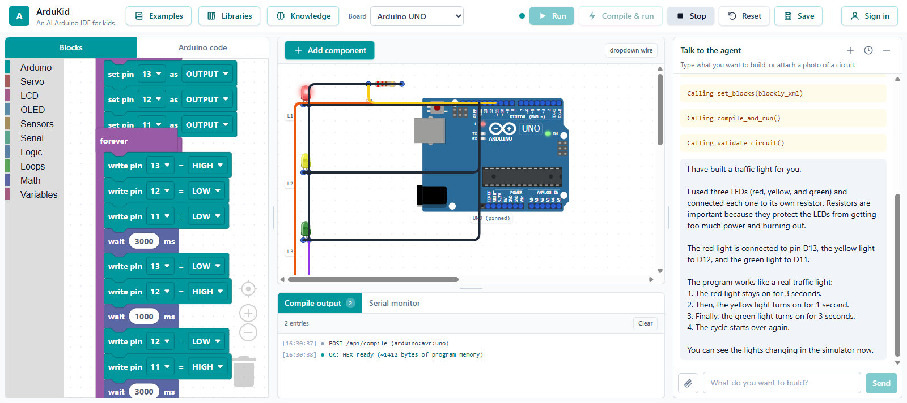
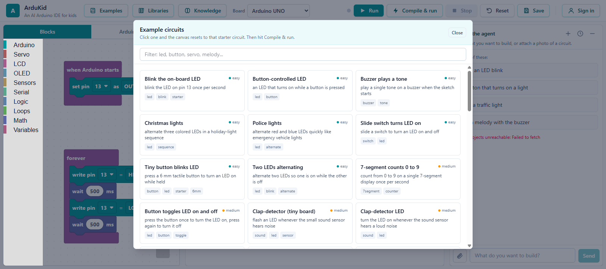
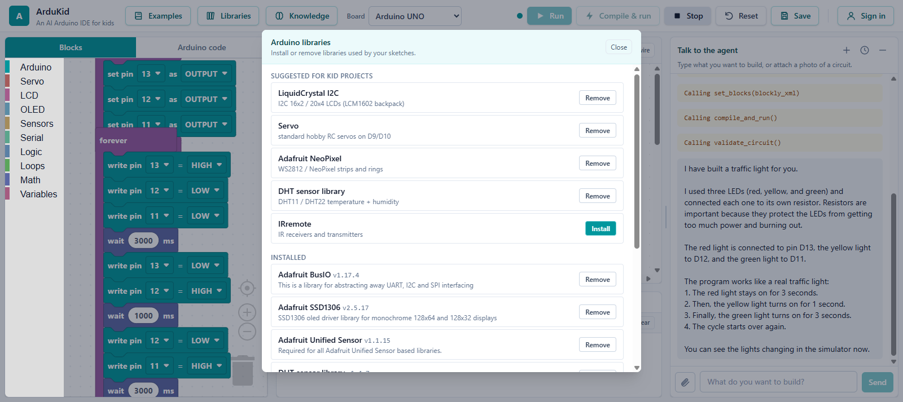
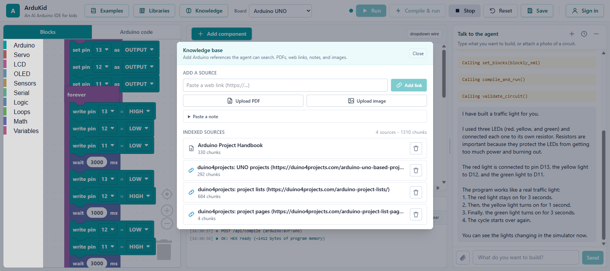
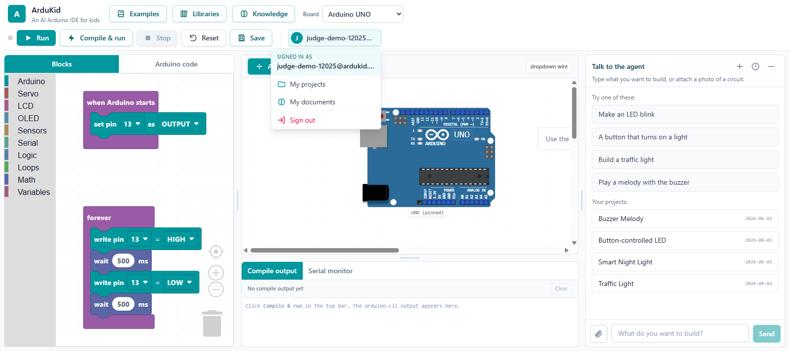
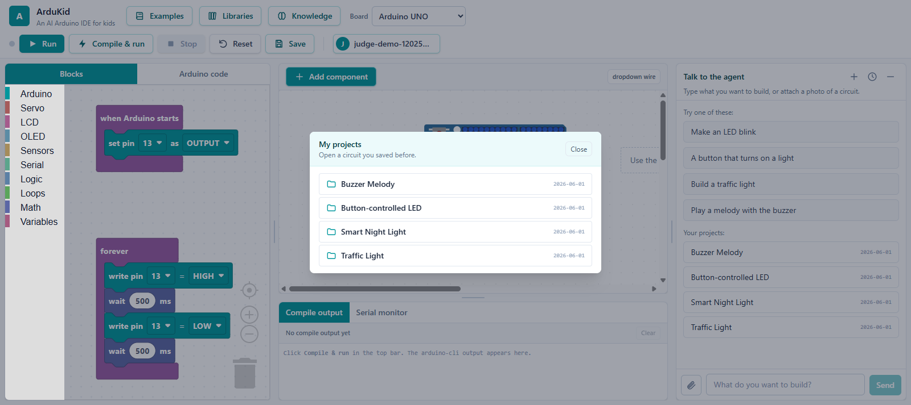
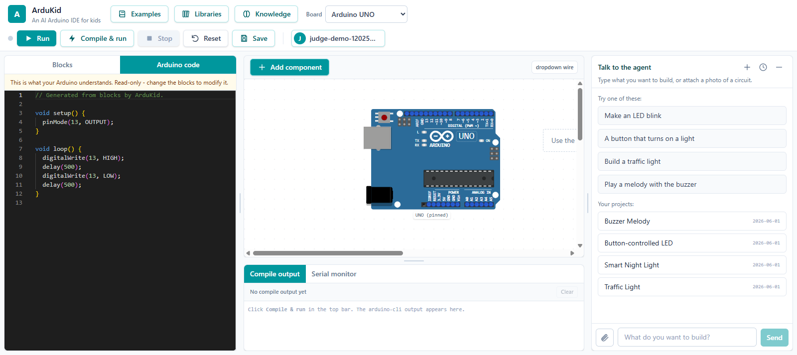
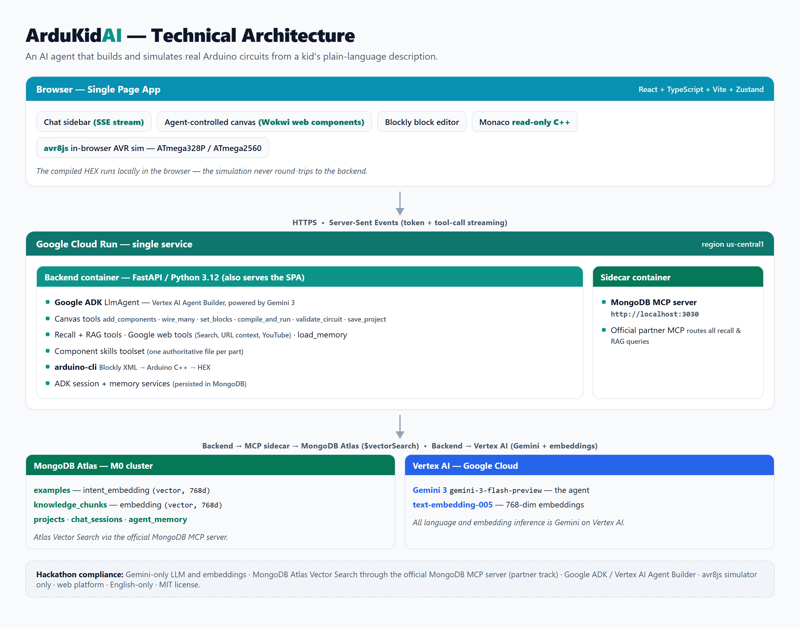

# ArduKid

An AI-powered mini-IDE for Arduino, designed for kids aged 8 to 14. A child
describes what they want in plain language and an AI agent picks the parts,
wires the circuit, writes a block-based program, compiles it to real Arduino
C++, and runs it in an in-browser AVR simulation - no physical hardware
required.

Built for the [Google Cloud Rapid Agent Hackathon](https://rapid-agent.devpost.com/),
MongoDB partner track.




*The child typed "Build a traffic light". The agent loaded the LED and resistor
skills, added three LEDs through resistors, wired them, wrote the Blockly
program, compiled it to a HEX file, and started the simulation - the red light
is lit and the cycle is running. Every step is visible in the chat on the right.*

---

## Table of contents

- [What it does](#what-it-does)
- [A tour of the app](#a-tour-of-the-app)
- [How the agent works](#how-the-agent-works)
- [Key features](#key-features)
- [Architecture](#architecture)
- [Hackathon compliance](#hackathon-compliance)
- [Tech stack](#tech-stack)
- [Local development](#local-development)
- [Deployment](#deployment)
- [Repository layout](#repository-layout)

## What it does

A kid types something like `"I want a traffic light"`. The agent works through
the build in a single turn:

1. **Reads its skills.** It activates the skills for the parts it will use (LED,
   resistor, ...) so it uses the exact pin names and correct wiring instead of
   guessing.
2. **Recalls and researches when useful.** It can pull a similar example from
   MongoDB Atlas Vector Search or look something up in its documentation
   knowledge base (RAG) - but for a routine build it relies on its skills and
   stays fast.
3. **Builds the circuit.** It adds all the parts and wires them on the canvas in
   batched tool calls. The canvas is agent-controlled, so the child watches it
   assemble itself.
4. **Writes the program.** It produces a Blockly block program and a read-only
   Arduino C++ translation.
5. **Compiles and runs.** The C++ is compiled to a HEX file with `arduino-cli`
   and executed in the browser AVR emulator.
6. **Validates and fixes.** A `validate_circuit` check looks for loose parts, a
   missing ground, an LED without a resistor, or a short circuit, and the agent
   fixes any issue before telling the child the build is ready.

The kid can then say `"make it blink faster"` or `"add a buzzer"` and the agent
edits the circuit and program in place. They can attach a photo of a real
circuit to the chat, add their own reference PDFs, web links, and notes to the
agent's knowledge base, and (optionally) sign in to save projects and have the
agent remember them across sessions.

## A tour of the app

### Example circuit library

Over 50 ready-made starter circuits, sorted by difficulty. Picking one loads it
straight onto the canvas (no agent call) so a child can explore, run it, and
then ask the agent to change it.



### Arduino library manager

The container ships with `arduino-cli` and the libraries the kid-level examples
need (LCD, NeoPixel, servo, sensors, OLED). The Libraries panel lets you install
or remove libraries and search the registry, so sketches that use them compile.



### Knowledge base (multimodal RAG)

Add Arduino references the agent can search: web links, PDFs, pasted notes, and
images (images are described by Gemini vision). Everything is chunked, embedded
with Gemini, and stored in MongoDB Atlas. The panel shows each indexed source
and its chunk count.



### Accounts, projects, and history

Signing in is optional - anonymous play works and scopes projects to the browser.
When signed in, the user menu gives access to saved projects and uploaded
documents, and the agent remembers the user across chats.

| User menu | My projects |
| --- | --- |
|  |  |

### The generated Arduino code

The block program is translated to real Arduino C++, shown read-only in a Monaco
editor. This is the exact code that is compiled and run - children can read
along and see what their blocks become.



## How the agent works

The agent is a single Google ADK `LlmAgent` running on Gemini 3 (Vertex AI). It
drives the whole build through structured tools, and the frontend applies each
tool result to the canvas. The tools fall into a few groups:

- **Canvas and program:** `list_available_components`, `add_components` /
  `add_component`, `remove_component`, `wire_many` / `wire`, `set_blocks`,
  `compile_and_run`, `validate_circuit`, `save_project`.
- **Skills:** `list_skills` and `load_skill` - filesystem skills (one per
  component, plus a Blockly-programming skill and a project-patterns skill) the
  agent reads on demand so it knows exact pins, wiring, and valid block types.
- **Recall and RAG (MongoDB via the MCP server):** `find_similar_example`,
  `search_docs`, `list_projects`, `load_project`.
- **Google-native web tools:** `search_web` (Google Search grounding),
  `read_web_page` (URL context), and `watch_youtube` - used only when the child
  explicitly asks to look something up, never to build.
- **Memory:** `load_memory` - semantic recall over the user's past conversations
  (their name, what they built last time), persisted in MongoDB Atlas.

Sessions and long-term memory are stored in MongoDB through custom ADK
`BaseSessionService` and `BaseMemoryService` implementations, so chat history
survives reloads and the agent can recall facts across separate chats.

## Key features

- **Agent on Google ADK + Gemini 3.** A single `LlmAgent` (Agent Development Kit
  on Vertex AI) drives the whole build through structured tools, capped per turn
  so it can handle complex multi-part circuits.
- **Component skills.** Filesystem skills the agent activates on demand for exact
  pin names and correct wiring, so it does not hallucinate connections.
- **MongoDB MCP + Atlas Vector Search (partner integration).** Example recall and
  documentation RAG run as `$vectorSearch` aggregations through the official
  `mongodb-mcp-server`. Query vectors are Gemini embeddings (768 dims), never a
  third-party provider.
- **Multimodal RAG.** Index reference PDFs, web links, pasted notes, and images
  into the knowledge base; the agent cites them via `search_docs`.
- **Persistent sessions and cross-session memory.** Chat history and long-term
  memory live in MongoDB Atlas via ADK session and memory services.
- **Multiple boards.** Arduino UNO, Nano, and Mega 2560 - each simulated on the
  correct microcontroller (ATmega328P for UNO/Nano, ATmega2560 for Mega) with the
  right pin map.
- **In-browser simulation with avr8js.** The compiled HEX runs locally on the
  emulated microcontroller; LEDs, buzzer (tone), servo (PWM), potentiometer
  (ADC), I2C LCD/OLED, pushbutton interrupts, and the serial monitor are all live.
- **Self-correcting circuits.** `validate_circuit` reports issues the agent must
  fix before telling the child the build is ready.
- **Optional accounts.** Anonymous play works out of the box; signing in adds
  saved projects, uploaded documents, and per-user memory.

## Architecture



```
Browser SPA (React + Zustand + Vite)
  chat  |  agent-controlled canvas (wokwi-elements)  |  Blockly + read-only C++
  avr8js runs the HEX locally - the simulation never round-trips to the backend
        |  HTTPS / SSE
        v
FastAPI backend (also serves the built SPA)
  Google ADK LlmAgent (Gemini 3 on Vertex AI)
  tools: add/remove components, wire, set_blocks, compile_and_run,
         validate_circuit, save_project           (canvas, applied in the browser)
         find_similar_example, search_docs, list/load_project, load_memory (recall)
         search_web, read_web_page, watch_youtube  (Google web)
  filesystem skills toolset  |  arduino-cli (Blockly XML -> C++ -> HEX)
  ADK session + memory services (chat history, long-term memory)
        |                                   |
        v                                   v
  mongodb-mcp-server  ---------------->  MongoDB Atlas
  (MCP sidecar container)  $vectorSearch   examples (intent_embedding, 768d)
                                           knowledge_chunks (embedding, 768d)
                                           projects, chat_sessions, agent_memory
  embeddings: Gemini text-embedding-005 (768 dims)
```

The backend is **dual-mode**: every data service talks to MongoDB through the
MCP server when `MCP_ENABLED=true`, falls back to a direct Atlas driver, and
finally to an in-memory store, so local development and tests run without any
cloud credentials. Embeddings are dual-mode too: Gemini when GCP creds are
present, else a deterministic hashed fallback (both 768-dim) so downstream code
never branches.

The full reference is [`doc/product-spec.md`](./doc/product-spec.md).

## Hackathon compliance

These are hard contest rules, not style choices:

- **LLM:** Gemini 3 (`gemini-3-flash-preview`) via Google Cloud / Vertex AI only.
- **Embeddings:** Gemini `text-embedding-005` (768 dims) only - no Voyage AI.
- **Partner:** MongoDB Atlas Vector Search through the official MongoDB MCP server.
- **Simulator:** avr8js only.
- **Agent framework:** Google ADK (Agent Development Kit).
- **English everywhere**, no emojis, no third-party logos, all code authored
  within the contest period.

## Tech stack

- **Frontend:** React, TypeScript, Vite, Tailwind CSS, Zustand, Blockly,
  `@wokwi/elements`, avr8js, Monaco.
- **Backend:** Python 3.12, FastAPI, Google ADK, google-genai, Motor (MongoDB),
  the MCP Python client, and `arduino-cli`.
- **Cloud:** Google Cloud (Vertex AI), MongoDB Atlas. Deployed as a single Cloud
  Run service that serves the SPA and API, with the MongoDB MCP server running as
  a sidecar container.

## Local development

Frontend:

```bash
cd frontend
npm install
npm run dev          # http://localhost:5173
```

Backend (requires uv and arduino-cli; runs in mock mode with no cloud creds):

```bash
cd backend
uv sync
uv run uvicorn app.main:app --reload --port 8080
```

To run the real agent, set `ARDUKID_AGENT_MODE=real`, `GOOGLE_CLOUD_PROJECT`,
and `MONGODB_URI` in `backend/.env` and authenticate with Google ADC.

### Seeding and the knowledge base

```bash
cd backend
uv run python -m scripts.seed_db          # components + example circuits (Atlas)
uv run python -m scripts.index_sources    # index reference docs into the RAG store
```

Reference sources can also be added at runtime from the in-app Knowledge panel
(PDF, web link, note, or image), or via `POST /api/knowledge/{pdf,url,text,image}`.

## Deployment

The app is deployed as a **single Cloud Run service** with two containers:

- **backend** - FastAPI + Google ADK + `arduino-cli`, and it also serves the
  built SPA at `/`, so the frontend and API are same-origin (no CORS).
- **mcp** - the official `mongodb-mcp-server` as a sidecar; the backend reaches it
  at `http://localhost:3030` and `MCP_ENABLED=true` routes all recall and RAG
  queries through it.

The service is described in [`deploy/service.yaml`](./deploy/service.yaml) and
deployed with `gcloud run services replace`. Secrets (`MONGODB_URI`,
`JWT_SECRET`) come from Secret Manager. For local container runs:

```bash
docker compose --profile mcp up -d        # backend + frontend + mongodb-mcp-server
```

See [`deploy/README.md`](./deploy/README.md) for the full recipe.

## Repository layout

```
doc/         Hackathon rules, product specification, project story, README screenshots
project/     Phase-by-phase implementation plan and progress tracker
frontend/    React + Vite single-page app
backend/     FastAPI agent service (ADK, tools, services, skills)
deploy/      Cloud Run service definition, Docker Compose, reverse-proxy config
```

## License

MIT. See [LICENSE](./LICENSE).
